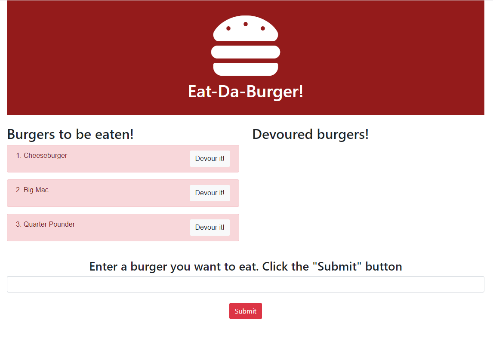
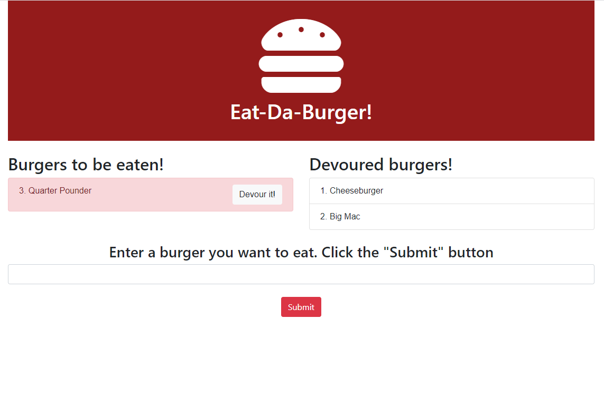

# Eat-Da-Burger

## Introduction: 

This app has been created for the user to add burgers they would like to eat to be displayed in a list of undevoured burgers. Once they have been devoured, the burgers will moved to a list of devoured burgers

The app has been created using: 
* Javascript
* Express.js
* Express Handlebars
* MySQL

The app has been deployed using Heroku on: 

## Preview: 

### List of undevoured burgers

### List of devoured burgers

